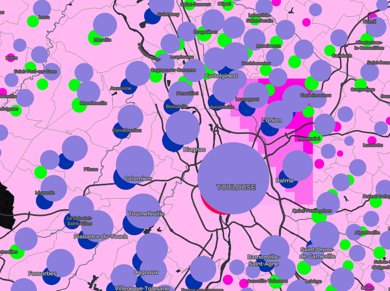
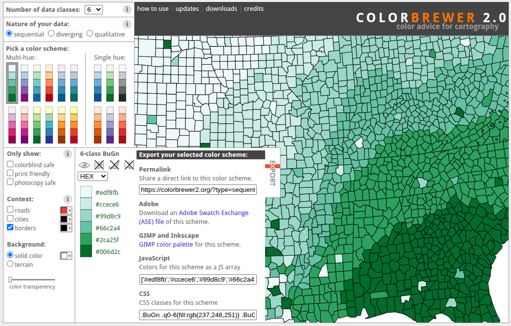
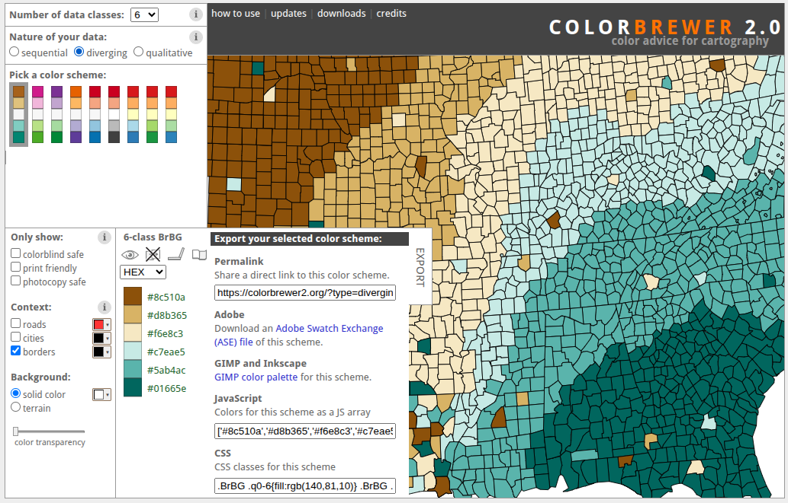
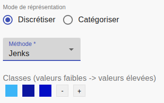
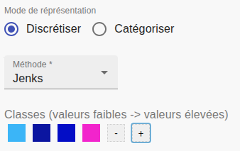
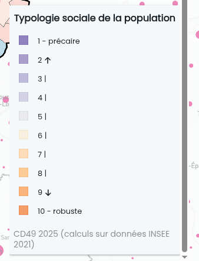
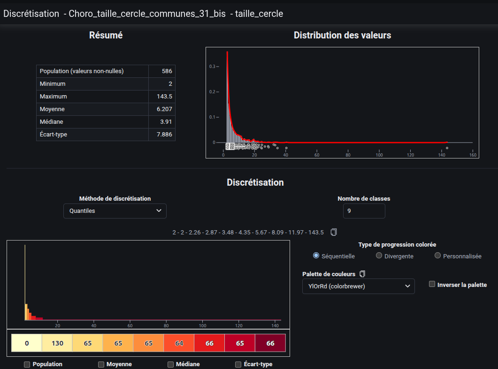
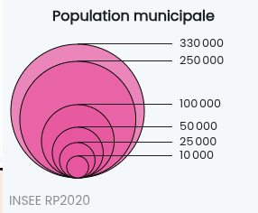
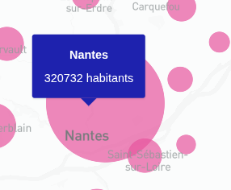
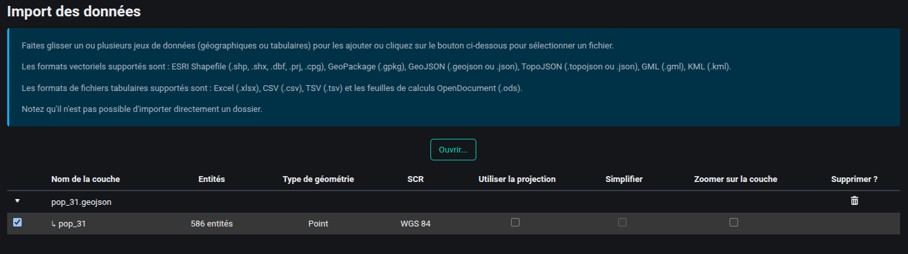

# Observations TerraVisu & Pistes d'amélioration

Petit bric à brac d'observations d'un point de vue d'un étudiant cartographe.

## 1. Sémiologie graphique

### 1.1 Variables visuelles

-  **Superposition de cercles proportionnels** : quand deux couches de cercles se superposent ou même au sein d'un même groupe, le plus petit doit passer devant. Des fois c'est l'inverse. 
Exemple :

  
 
De manière générale c'est jamais une bonne idée de représenter deux couches différents par une même variable visuelle mais avec la multitude de couche sur TerraVisu ça peut arriver.

### 1.2 Palettes de couleurs

-  **Choix de palette à la discrétisation** : pour l'instant une seule palette est imposée. Il faudrait proposer plusieurs options, notamment une palette divergente. Des sites comme [ColorBrewer](https://colorbrewer2.org/) en propose plein. On peut notamment exporter des palettes au format JS Array.

  
  

-  **Cohérence à l'ajout de classes** : quand on ajoute une classe, la couleur ajoutée ne s'intègre pas dans la palette existante. Le rendu est incohérent.

  
  
  
<em>Ajout d'une 4e classe</em>

-  **Dégradés** : pas de contrôle possible sur les dégradés, et quand il y en a un il est mal représenté dans la légende. Exemple : `Typologie de la population par âge - Observatoire du territoire du Maine-et-Loire`

 

Même si dans ce cas une palette divergente convient mieux car on fait une typologie. Un dégradé convient mieux pour une variation locale de valeur. Exemple : niveau d'élévation terrestre ou marin ou encore pour une interpolation. Très peu de cas où le dégradé s'impose dans les instances TerraVisu que j'ai pu observé jusque là.
  

### 1.3 Discrétisation

-  **Aide à la discrétisation** : pas d'aide visuelle pour choisir la méthode (Jenks, quantiles, intervalles égaux...). [Magrit (CNRS)](https://magrit.cnrs.fr/app/#) propose un bon exemple à suivre : visualisation de la distribution + répartition au sein des classes.

  

Les palettes utilisées sont d'ailleurs celle de ColorBrewer... je pose ça là.
  

-  **Nombre de classes par défaut** : on démarre toujours avec 3 classes, ce qui est peu. Il faudrait au moins laisser le choix dès le départ. Ou au moins 5.

### 1.4 Légende

-  **Cercles proportionnels en légende** : la convention sémiologique est de montrer le cercle de la valeur max, celui de la valeur min, et quelques valeurs intermédiaires lisibles (ex : max 2673, min 23 et afficher aussi 500 et 1500). Ce n'est pas forcément le cas actuellement . Exemple : `Répartition de la population - Observatoire du territoire du Maine-et-Loire`

  
  
  
<em>Le max correspond à Nantes avec 320732 mais on affiche 330000</em>

-  **Représentation des parts** : quand une couche représente des parts, la légende affiche des cercles de tailles inégales qui ressemblent à du ponctuel. Ce n'est pas adapté mais difficle de faire autrement dans ce cas là.
-  **Organisation de la légende** : quand plusieurs couches sont actives, la légende devient difficile à lire. Il faudrait regrouper par source ou par thème. 
-  **Aperçu de la légende dans l'admin** : aujourd'hui on ne voit pas le rendu de la légende sans publier. Un aperçu en temps réel dans l'interface d'administration serait utile.
-  **Intéraction avec la légende** : ça serait bien de pouvoir désactiver/activer une couche depuis la légende pour mieux comprendre l'implication.

---

## 2. Cartographie

-  **Reset du pitch** : le bouton de réinitialisation remet bien le nord, mais pas l'inclinaison (pitch). Il faudrait un reset complet de la vue 3D.

---

## 3. Données

-  **Chargement des données** : L'import des données apporte une faible compréhension de la données qu'on vient d'importer. Un aperçu des premières lignes et entête pourrait aider. En s'inspirant de Magrit encore une fois on peut automatiser la détection du type de géometrie et proposer un apercçu de quelques caractéristiques de la source de donnée qu'on vient de charger.

  

## 4. Ressources

- [TerraVisu -- GitHub](https://github.com/Terralego/TerraVisu)
- [Magrit -- outil de cartographie CNRS](https://magrit.cnrs.fr) 
- Bertin, J. (1967).  *Sémiologie graphique*
- Brewer -- [ColorBrewer](https://colorbrewer2.org)

